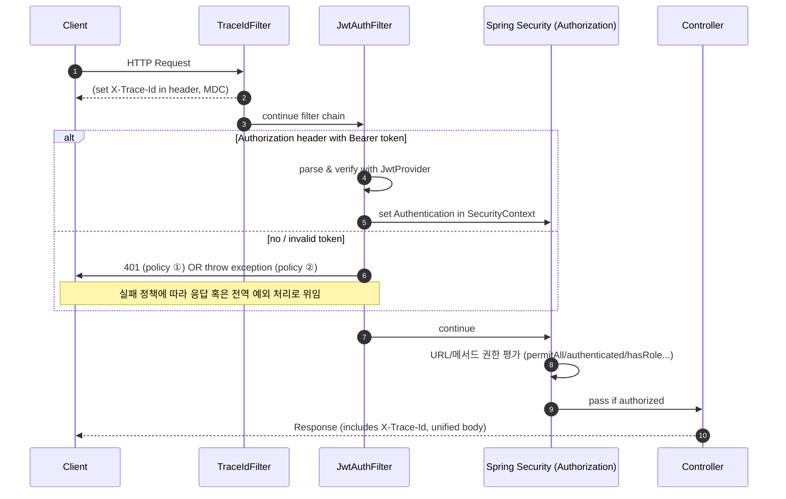

# 📖 Spring Boot 학습 정리 (B단계 ~ C단계)

<details>
<summary>B단계: 스프링 핵심 원리</summary>
### 1. 스프링 컨테이너와 빈 등록
스프링에서는 객체를 직접 생성하지 않고 `@Configuration` 클래스와 `@Bean` 메서드를 통해 **스프링 컨테이너**가 객체를 생성하고 관리합니다.  
이렇게 등록된 객체를 **스프링 빈(Bean)** 이라고 부릅니다.

- 장점: 객체 생명주기를 컨테이너가 관리 → 메모리 효율, 재사용성 증가
- 코드 예시:
```java
@Configuration
public class AppConfig {
    @Bean
    public MemberService memberService() {
        return new MemberServiceImpl();
    }
}
```

### 2. 싱글톤 패턴 vs 스프링 싱글톤
- **직접 구현한 싱글톤 패턴**  
  → 인스턴스를 하나만 만들도록 static 필드로 관리. 코드가 복잡하고 테스트 어려움.

- **스프링 싱글톤 컨테이너**  
  → 기본 스코프가 싱글톤이므로, 같은 빈을 여러 번 주입받아도 실제 객체는 1개.  
  개발자가 직접 싱글톤 패턴을 구현할 필요가 없음.

### 3. 의존관계 주입 (DI)
스프링이 객체 간 의존관계를 자동으로 연결해줌.  
**생성자 주입**이 가장 권장됨.

```java
@Service
public class MemberService {
    private final MemberRepository repository;

    @Autowired
    public MemberService(MemberRepository repository) {
        this.repository = repository;
    }
}
```

- 장점: 불변성 보장, 테스트 용이성 증가, 순환참조 방지

### 4. 스프링 MVC 요청 흐름
- `DispatcherServlet`이 모든 요청을 받아서 컨트롤러에 위임
- 컨트롤러 → 서비스 → 리포지토리 계층 순으로 실행
- 응답은 뷰 리졸버(ViewResolver) 또는 JSON 변환을 통해 클라이언트로 전달

### 5. HTTP 요청 데이터 처리
- `@RequestParam` : 단일 파라미터 매핑
- `@ModelAttribute` : 객체 바인딩
- `@RequestBody` : JSON 요청 매핑

### 6. HTTP 응답 처리
- `@ResponseBody` : 객체 → JSON 변환
- `@RestController` : `@Controller + @ResponseBody` 조합 → REST API 응답에 적합

---

## C단계: 기능 확장 & 고도화

### 1. JSON 응답 처리
스프링은 내부적으로 `HttpMessageConverter`(Jackson)를 사용하여 객체를 JSON으로 자동 변환합니다.

- 코드 예시:
```java
@RestController
public class MemberController {
    @GetMapping("/api/members")
    public List<Member> findAll() {
        return memberService.findAll();
    }
}
```

### 2. DTO와 응답 포맷 개선
엔티티를 직접 노출하지 않고 **DTO(Data Transfer Object)** 로 응답을 전달.  
추가로 공통 응답 포맷(`ApiResponse<T>`)을 정의하여 일관된 API 설계.

```json
{
  "status": 200,
  "message": "OK",
  "data": { ... },
  "traceId": "uuid",
  "timestamp": "2025-08-18T19:00:00"
}
```

### 3. Validation 적용
요청 DTO에 제약 조건을 추가해 유효성을 검증.

```java
public class MemberRequest {
    @NotBlank
    private String name;
}
```

- `@Valid`와 함께 사용 → 잘못된 요청 시 `MethodArgumentNotValidException` 발생
- 전역 예외 처리기로 잡아서 `ApiResponse` 포맷으로 반환

### 4. 제네릭 충돌 문제 (Void vs Object)
`ApiResponse.error()` 호출 시 제네릭 타입이 `Object`로 추론되는 문제 발생.  
해결 방법:
```java
ApiResponse<Void> body = ApiResponse.error(...);
return ResponseEntity.badRequest().body(body);
```

### 5. stream()의 역할
자바 스트림 API는 컬렉션 데이터를 선언적으로 처리하기 위한 기능.

```java
return memberService.findMembers().stream()
        .map(m -> new MemberResponse(m.getId(), m.getName()))
        .toList();
```

- 장점: 코드 간결성, 병렬 처리 지원

### 6. ResponseEntity의 역할
HTTP 응답을 세밀하게 제어 가능.

```java
return ResponseEntity
        .status(HttpStatus.CREATED)
        .header("X-Custom", "value")
        .body(responseDto);
```

- 상태 코드, 헤더, 바디를 자유롭게 설정 가능

---

## 운영 품질 개선

### 1. TraceId
- 요청마다 UUID를 생성하여 응답 JSON + 헤더(`X-Trace-Id`)에 추가
- 로그와 클라이언트를 연결해 장애 추적이 쉬움
- 마이크로서비스 환경에서는 분산 추적 필수 요소

### 2. RequestLoggingFilter
- 요청/응답 실행 시간, 상태코드, 바디 크기 등을 기록
- 슬로우 요청(SLOW) 감지 가능
- `FilterRegistrationBean`으로 순서 제어하여 traceId와 함께 동작

### 3. Filter를 Bean으로 등록한 이유
- 실행 순서 보장 (`order` 값)
- 운영 환경/테스트 환경에 따라 등록 유연성
- `@Component`보다 명시적으로 제어 가능

### 4. Filter vs Interceptor vs AOP
- **Filter**: HTTP 레벨 공통 기능 (traceId, 로깅, 인증)
- **Interceptor**: 컨트롤러 전후 (인증/인가)
- **AOP**: 서비스 계층 공통 관심사 (트랜잭션, 성능 모니터링)

---

## 추가 학습 질문 정리

- **traceId를 왜 사용하는가?**  
  → 요청 단위 추적, 장애 분석, 마이크로서비스 간 요청 흐름 추적

- **common 패키지 + WebConfig 등록 이유?**  
  → 전역 공통 기능 제공, 필터 실행 순서 보장, 운영환경별 관리 용이

- **ApiResponse.ErrorDetail 오류**  
  → 내부 클래스라면 `static` 선언 필요 (직렬화 오류 방지)

---
</details>

<details>
<summary>JWT_Auth_Flow</summary>

# JWT 인증 흐름 정리 (JwtAuthFilter · JwtProvider · SecurityConfig)

---

## 1) 요약

- **JwtProvider**: JWT **발급/검증** 유틸. 시크릿 키로 서명/검증, 클레임 추출.
- **JwtAuthFilter**: HTTP 요청에서 `Authorization: Bearer <JWT>` **파싱 → 검증 → SecurityContext 주입**.
- **SecurityConfig**: 시큐리티 **정책(인가 규칙, 세션/CSRF, 필터 순서)**을 정의.

---

## 2) 요청 1건의 처리 순서 (큰 그림)



> 권장 실패 정책: **필터에서 예외를 던져 전역 예외 처리기**가 공통 응답 포맷으로 변환하도록 구성(일관성 확보).

---

## 3) 구성요소별 역할 & 책임

### 3.1 JwtProvider — JWT 발급/검증 유틸리티

| 기능 | 설명 | 비고 |
|---|---|---|
| **createToken(subject, role, claims)** | `sub`, `role`, `iat`, `exp` 세팅 후 **서명**하여 문자열 토큰 발급 | JJWT 사용 (HMAC-SHA) |
| **parse(token)** | 시크릿 키로 **서명 검증**, 만료/위조/형식 오류 시 예외 | `Jws<Claims>` 반환 |
| **키 관리** | `application.yml/properties`의 `jwt.secret.key`로 Key 생성 | **최소 32바이트** 이상 권장 |
| **만료 설정** | `jwt.access-token-validity-seconds`로 토큰 만료 제어 | 운영 환경에서 짧게(예: 1h) |

**샘플 설정 (properties)**
```properties
jwt.secret.key=ThisIsADevOnlySecretKeyThatIsAtLeast32BytesLong!!!
jwt.access-token-validity-seconds=3600
```

---

### 3.2 JwtAuthFilter — 요청당 한 번 실행되는 인증 필터

| 단계 | 동작 | 결과 |
|---|---|---|
| 1 | `Authorization` 헤더 확인 (`Bearer <JWT>`) | 토큰 유무 판단 |
| 2 | `JwtProvider.parse()`로 검증 | 서명/만료/형식 검사 |
| 3 | 성공 시 `UsernamePasswordAuthenticationToken` 생성 | `SecurityContextHolder`에 **인증 객체 저장** |
| 4 | 실패 정책 | ① **즉시 401 응답** 또는 ② **예외 throw → 전역 핸들러 처리** |
| 5 | (선택) `MDC.put("user", username)` | 로그에 사용자 식별자 자동 포함 |

> 필터는 반드시 **`UsernamePasswordAuthenticationFilter` 앞**에 등록하여, 인가 단계 전에 인증을 완료하도록 한다.

---

### 3.3 SecurityConfig — 시큐리티 전반 정책

| 설정 | 내용 | 목적 |
|---|---|---|
| **Session = STATELESS** | 세션 비활성(Stateless) | JWT 형태에 적합 |
| **CSRF 비활성** | `csrf().disable()` | REST API 기본 |
| **인가 규칙** | `authorizeHttpRequests`로 **경로별 접근 정책** | 공개/보호 API 구분 |
| **필터 순서** | `addFilterBefore(new JwtAuthFilter, UsernamePasswordAuthenticationFilter.class)` | 표준 인증 전 JWT 인증 수행 |
| **CORS/예외 엔트리포인트** | 필요 시 추가 | 클라이언트/보안 정책 정교화 |

---

## 4) 케이스별 동작 요약

- **공개 API** (`permitAll`)
  - 토큰 없음: 그대로 통과 → 컨트롤러 실행
  - 토큰 있음: 검증 성공 시 인증된 사용자로 접근(컨트롤러에서 `Authentication` 활용 가능)

- **보호 API** (`authenticated`/`hasRole`)
  - 토큰 없음/무효: 인가 단계에서 401/403
  - 유효 토큰: 인증 객체 세팅 → 인가 통과 → 컨트롤러 실행

---

## 5) 운영 팁 & 체크리스트

- [ ] `jwt.secret.key`는 **32바이트 이상**(HMAC-SHA256) — 짧으면 `WeakKeyException` 유발
- [ ] 실패 정책을 **전역 예외 처리기**로 통일 → `ApiResponse` 포맷 유지
- [ ] `TraceIdFilter`를 **가장 먼저** 실행해 로그/응답에 traceId 포함
- [ ] 로깅에 **MDC(traceId, user)**를 써서 장애 추적 용이성 확보
- [ ] 보호/공개 경로의 **패턴 매칭**이 겹치지 않는지 확인
- [ ] 토큰/민감정보는 **로그 마스킹** 적용

---

## 6) 미니 예시 (요약 형태)

```java
// SecurityConfig (요약)
http.csrf(csrf -> csrf.disable())
    .sessionManagement(sm -> sm.sessionCreationPolicy(STATELESS))
    .authorizeHttpRequests(auth -> auth
        .requestMatchers("/api/auth/login", "/health").permitAll()
        .requestMatchers("/api/members/**").authenticated()
        .anyRequest().permitAll())
    .addFilterBefore(new JwtAuthFilter(jwtProvider), UsernamePasswordAuthenticationFilter.class);
```

```java
// JwtAuthFilter (요약)
protected void doFilterInternal(req, res, chain) {
  String header = req.getHeader("Authorization");
  if (hasBearer(header)) {
    var jws = jwtProvider.parse(token(header));
    var auth = new UsernamePasswordAuthenticationToken(jws.getPayload().getSubject(), null,
        List.of(new SimpleGrantedAuthority("ROLE_" + jws.getPayload().get("role", String.class))));
    SecurityContextHolder.getContext().setAuthentication(auth);
  }
  chain.doFilter(req, res);
}
```

```java
// JwtProvider (요약)
public String createToken(String username, String role) {
  Instant now = Instant.now();
  return Jwts.builder()
    .subject(username)
    .claim("role", role)
    .issuedAt(Date.from(now))
    .expiration(Date.from(now.plusSeconds(validity)))
    .signWith(key)
    .compact();
}
```

---

### 참고
- 토큰 실패를 **필터에서 직접 401로 쓰지 않고**, 커스텀 예외를 던져 전역 예외 처리기에서 공통 포맷으로 내려주는 방식이 더 낫다.
- 분산 추적을 계획한다면, `X-Trace-Id`와 **표준 trace 헤더**(W3C traceparent)를 병행 가능하다.

</details>

<details>
<summary>AOP_Execution_Logging</summary>

# AOP 기반 실행 시간 & 입력값 로깅 (Spring Boot)

## 1. 목표
- 메서드 실행 시간을 자동으로 측정하여 로깅한다.
- 입력값을 함께 기록하되, **민감 정보(password, token 등)는 마스킹 처리**한다.
- traceId와 연계하여 **장애 추적**을 쉽게 만든다.

---

## 2. 주요 컴포넌트

### 2.1 @LogExecutionTime (커스텀 애노테이션)
```java
@Target(ElementType.METHOD)
@Retention(RetentionPolicy.RUNTIME)
public @interface LogExecutionTime { }
```

→ 메서드 위에 붙이면 AOP가 동작한다.

### 2.2 LoggingAspect (AOP 구현체)
- `@Around` advice로 메서드 전후를 감싼다.
- 실행 시간 = `System.currentTimeMillis()`로 측정
- 입력 파라미터 로깅 시 민감 정보(`password`, `token`, `secret` 등)는 `***` 처리
- 반환값은 크면 타입만 기록
- traceId(MDC)에 함께 기록하여 로그 상관관계 추적 가능

```java
@Around("@annotation(com.example.solwith.aop.LogExecutionTime)")
public Object around(ProceedingJoinPoint pjp) throws Throwable {
    long start = System.currentTimeMillis();
    // ... 실행 전 로깅
    Object result = pjp.proceed();
    long took = System.currentTimeMillis() - start;
    // ... 실행 후 로깅
    return result;
}
```

---

## 3. 동작 순서

1. 클라이언트가 요청 → `TraceIdFilter`에서 traceId를 생성하고 MDC에 저장
2. 컨트롤러/서비스 메서드에 `@LogExecutionTime`이 있으면 `LoggingAspect`가 가로챈다
3. 메서드 실행 전: 파라미터를 문자열로 변환하여 로깅 (민감값은 `***`)
4. 실제 비즈니스 로직 실행 (`pjp.proceed()`)
5. 실행 후: 실행 시간(ms), 반환 타입, traceId와 함께 로깅
6. 예외 발생 시: 실행 시간 + 예외명 + 메시지를 warn 레벨로 기록

---

## 4. 로그 예시

```
[AOP] MemberService.findOne took=123ms traceId=abc-123 args=id=10 resultType=Member
[AOP] MemberService.join EX took=45ms traceId=abc-456 args=name=kim,password=*** ex=IllegalStateException:이미 존재
```

---

## 5. 적용 방법

### 5.1 서비스 메서드에 적용
```java
@LogExecutionTime
public Member findOne(Long id) {
    // ...
}
```

### 5.2 로그 패턴 설정 (logback-spring.xml)
```xml
<property name="PATTERN" value="[%d{yyyy-MM-dd HH:mm:ss.SSS}] %-5level [%X{traceId}] %logger{36} - %msg%n"/>
```

---

## 6. 운영 TIP

- **민감 정보 마스킹 규칙**: `password`, `token`, `secret`, `authorization` 등은 반드시 `***` 처리
- **traceId 연계**: 필수적으로 로그 패턴에 `%X{traceId}`를 포함시켜야 한다.
- **AOP 적용 범위**: 서비스/레포지토리/외부 연동 호출에 주로 붙여서 성능/장애 모니터링에 활용
- **Spring Boot AOP Starter** 사용 시 `@EnableAspectJAutoProxy`는 필요 없음.
- 반환값이 큰 객체는 타입명만 출력하여 로그 오염 방지.

---

## 7. 체크리스트

- [ ] `@LogExecutionTime`이 필요한 메서드에 붙였는가?
- [ ] 로그 패턴에 `%X{traceId}`가 들어갔는가?
- [ ] 민감 파라미터 마스킹이 잘 되는가?
- [ ] 반환값 로그가 과도하게 크지 않은가?
- [ ] 예외 발생 시 warn/error 레벨로 기록되는가?

---

## 8. 결론

- `@LogExecutionTime` + `LoggingAspect`를 통해 **운영 가시성**을 확보할 수 있다.
- traceId + 실행 시간 + 입력값/반환값을 로그에 남겨 **장애 분석과 성능 최적화**에 큰 도움이 된다.
</details>

<details>
<summary>메서드 보안<@PreAuthorize> + 역할 계층<Role Hierarchy></summary>

# 메서드 보안(@PreAuthorize) & 역할 계층(Role Hierarchy) 완전 정복

> Spring Boot 3 / Spring Security 6 기준.  
> **메서드 보안 활성화 → 역할 계층 적용 → JWT 권한 주입 → 소유권(Ownership) 검사 → HTTP 보안과의 병행 사용**

---

## 1) 핵심 개념

- **@PreAuthorize**: 메서드 호출 **직전**에 SpEL로 접근 조건 평가. (권한/로그인 여부/파라미터 기반)
- **Role Hierarchy**: `ROLE_ADMIN > ROLE_MANAGER > ROLE_USER`처럼 **상위 역할이 하위 역할을 포함**하도록 하는 기능.
- **HTTP 보안 vs 메서드 보안**:
  - **HTTP 보안**은 URL 경로 레벨의 1차 장벽(대략적인 공개/보호 구분).
  - **메서드 보안**은 서비스/컨트롤러 메서드 레벨의 2차 장벽(정밀 권한/소유권 검사).
  - 둘은 **독립적으로** 작동하며, **둘 다 통과**해야 최종 실행된다.

---

## 2) 기본 설정

### 2.1 메서드 보안 활성화
```java
// src/main/java/com/example/solwith/auth/SecurityConfig.java
@Configuration
@EnableWebSecurity
@EnableMethodSecurity(prePostEnabled = true) // ✅ @PreAuthorize/@PostAuthorize 활성화
public class SecurityConfig {
    // 기존 http 설정 + JwtAuthFilter 등록
}
```

### 2.2 역할 계층 등록 (신규 방식: fromHierarchy)
```java
// src/main/java/com/example/solwith/auth/MethodSecurityConfig.java
@Configuration
public class MethodSecurityConfig {

    // ADMIN > MANAGER > USER (위 역할이 아래 역할을 “상속”)
    @Bean
    static org.springframework.security.access.hierarchicalroles.RoleHierarchy roleHierarchy() {
        return org.springframework.security.access.hierarchicalroles.RoleHierarchyImpl.fromHierarchy(
            """
            ROLE_ADMIN > ROLE_MANAGER
            ROLE_MANAGER > ROLE_USER
            """
        );
    }

    // @PreAuthorize 해석기에 역할 계층을 적용
    @Bean
    static org.springframework.security.access.expression.method.MethodSecurityExpressionHandler
    methodSecurityExpressionHandler(org.springframework.security.access.hierarchicalroles.RoleHierarchy roleHierarchy) {
        var handler = new org.springframework.security.access.expression.method.DefaultMethodSecurityExpressionHandler();
        handler.setRoleHierarchy(roleHierarchy);
        return handler;
    }
}
```

> **주의:** Spring Security 6부터 `new RoleHierarchyImpl()` 기본 생성자 대신 `fromHierarchy(...)` 사용 권장.  
> 모든 권한 문자열은 관례상 **`ROLE_` 접두사**를 사용한다.

---

## 3) JWT ↔ 권한(Authorities) 매핑 패턴

JWT에 담긴 클레임을 `GrantedAuthority`로 변환해 `SecurityContext`에 주입해야 @PreAuthorize가 동작한다.  
(우리 예제는 `JwtAuthFilter`에서 수행)

### 3.1 단일 역할(String) 사용
**JWT Claims**
```json
{
  "sub": "alice",
  "role": "ADMIN"
}
```
**필터 변환**
```java
String role = claims.get("role", String.class); // "ADMIN"
List<GrantedAuthority> auths = List.of(new SimpleGrantedAuthority("ROLE_" + role));

var auth = new UsernamePasswordAuthenticationToken(username, null, auths);
SecurityContextHolder.getContext().setAuthentication(auth);
```

### 3.2 다중 역할(List<String>) 사용
**JWT Claims**
```json
{
  "sub": "bob",
  "roles": ["USER","MANAGER"]
}
```
**필터 변환**
```java
List<String> roles = claims.get("roles", List.class); // ["USER","MANAGER"]
List<GrantedAuthority> auths = roles.stream()
    .map(r -> new SimpleGrantedAuthority("ROLE_" + r))
    .toList();
SecurityContextHolder.getContext().setAuthentication(
    new UsernamePasswordAuthenticationToken(username, null, auths));
```

### 3.3 이미 `ROLE_` 접두사가 붙은 경우
**JWT Claims**
```json
{ "sub": "carol", "roles": ["ROLE_USER","ROLE_MANAGER"] }
```
**필터 변환**
```java
List<String> roles = claims.get("roles", List.class);
List<GrantedAuthority> auths = roles.stream()
    .map(SimpleGrantedAuthority::new) // 이미 ROLE_ 접두사 포함
    .toList();
```

### 3.4 (선택) 계층 확장 적용 – HTTP 단계까지 확실히 반영
```java
// 필터에서 상위 → 하위 권한 확장
List<GrantedAuthority> base = auths;
Collection<? extends GrantedAuthority> expanded =
        roleHierarchy.getReachableGrantedAuthorities(base);

var auth = new UsernamePasswordAuthenticationToken(username, null, expanded);
SecurityContextHolder.getContext().setAuthentication(auth);
```

> 이렇게 하면, 예컨대 `ROLE_ADMIN` 토큰이 자동으로 `ROLE_MANAGER`, `ROLE_USER` 권한도 포함하게 된다.

---

## 4) @PreAuthorize 실전 패턴 모음

### 4.1 단순 역할 검사
```java
@PreAuthorize("hasRole('ADMIN')")
public void deleteMember(Long id) { ... }

@PreAuthorize("hasAnyRole('MANAGER','ADMIN')")
public List<Member> listAll() { ... }

@PreAuthorize("isAuthenticated()")
public Member myProfile() { ... }
```

### 4.2 소유권(Ownership) 검사 — 다양한 경우의 수

#### (A) JWT `sub`에 **username**이 들어있는 경우
- `JwtAuthFilter`에서 principal을 **username**으로 설정했다면:  
  `authentication.name` == username

```java
@PreAuthorize("#username == authentication.name")
public Member getByUsername(String username) { ... }
```

#### (B) JWT `sub`에 **userId(Long)** 가 들어있는 경우
- principal이 문자열(username)이라면 비교 형 변환 필요
```java
@PreAuthorize("#userId.toString() == authentication.name") 
public Order getMyOrder(Long userId, Long orderId) { ... }
```
- 또는 principal 자체를 userId로 저장하는 방식도 가능
```java
// 필터에서 principal을 userId(Long)로 저장했다면:
@PreAuthorize("#userId == principal") 
public Order getMyOrder(Long userId, Long orderId) { ... }
```

#### (C) 커스텀 Principal 객체 사용 (권장)
- 필터에서 `new UsernamePasswordAuthenticationToken(customPrincipal, null, auths)`로 주입
- 커스텀 객체에 `id`, `username`, `roles` 등 보유
```java
@PreAuthorize("#memberId == principal.id") 
public Member getMyMember(Long memberId) { ... }
```

#### (D) 도메인 레벨 체크(레포지토리 질의) — @bean 메서드 호출
- SpEL에서 **빈 메서드**를 호출하여 DB로 소유권 판단
```java
@PreAuthorize("@memberSecurity.isOwner(#memberId, authentication.name)")
public Member getMember(Long memberId) { ... }

@Component
public class MemberSecurity {
  private final MemberRepository repo;
  public boolean isOwner(Long memberId, String username) {
    return repo.existsByIdAndUsername(memberId, username);
  }
}
```

### 4.3 반환값 기반 검사 — @PostAuthorize
- 메서드가 반환한 객체의 소유자만 접근 허용
```java
@PostAuthorize("returnObject.ownerUsername == authentication.name")
public Document getDoc(Long id) { ... }
```

> **TIP:** 소유권 검사는 **서비스 계층**에도 중복으로 거는 게 안전합니다(컨트롤러 우회 호출 방지).

---

## 5) HTTP 보안 규칙(선택) + 메서드 보안 함께 쓰기

### 5.1 추천 구성
```java
http
  .csrf(csrf -> csrf.disable())
  .sessionManagement(sm -> sm.sessionCreationPolicy(SessionCreationPolicy.STATELESS))
  .authorizeHttpRequests(auth -> auth
      .requestMatchers("/api/auth/login", "/health").permitAll() // 공개
      .anyRequest().authenticated() // 그 외엔 인증 필요(1차 장벽)
  )
  .addFilterBefore(new JwtAuthFilter(jwtProvider), UsernamePasswordAuthenticationFilter.class);
```
- URL 레벨에서는 **대략적인 공개/보호**만 나눈다.
- **정밀 권한/소유권**은 `@PreAuthorize`로 제어(2차 장벽).

### 5.2 FAQ
- `permitAll()`이어도 메서드에 `@PreAuthorize`가 있으면? → **차단**된다(메서드 보안이 별도로 적용).
- 반대로 URL에서 `authenticated()`인데 메서드에 조건이 없다면? → **인증만 있으면 통과**한다.
- **둘 다 통과해야** 실제 실행.

---

## 6) 테스트 시나리오 (빠른 검증)

1. 토큰 없음 → `@PreAuthorize("isAuthenticated()")` 메서드 호출 시 **401 또는 403**
2. `ROLE_USER` 토큰 → `hasRole('USER')` 메서드 **200**
3. `ROLE_MANAGER` 토큰 → `hasRole('USER')` 메서드 **200** (계층 상속)
4. `ROLE_USER` 토큰 → `hasRole('ADMIN')` 메서드 **403**
5. 소유권 검사: 본인은 **200**, 타인은 **403**
6. `@PostAuthorize` 반환값 검사: 소유자 외에는 **403**

---

## 7) 흔한 오류 & 체크리스트

- [ ] `@EnableMethodSecurity(prePostEnabled = true)`를 켰는가?
- [ ] 권한 문자열에 **`ROLE_` 접두사**를 사용했는가?
- [ ] `RoleHierarchyImpl.fromHierarchy(...)`로 **계층을 등록**했는가?
- [ ] `DefaultMethodSecurityExpressionHandler#setRoleHierarchy(...)`로 **메서드 보안에 계층 적용**했는가?
- [ ] JWT 필터에서 **권한을 올바로 주입**했는가? (단일/다중/ROLE_ 여부)
- [ ] 커스텀 Principal 또는 SpEL bean 호출로 **소유권 판단**이 정확한가?
- [ ] URL 규칙과 메서드 보안이 **중복/충돌 없이** 조합되는가?

---

## 8) 미니 예시 모음

**서비스 예시**
```java
@Service
public class MemberService {

  @PreAuthorize("hasRole('ADMIN')")
  public void deleteMember(Long id) { ... }

  @PreAuthorize("isAuthenticated()")
  public Member myProfile() { ... }

  // 소유권: JWT sub가 username인 경우
  @PreAuthorize("#username == authentication.name")
  public Member getByUsername(String username) { ... }

  // 소유권: 커스텀 Principal 객체 사용
  @PreAuthorize("#memberId == principal.id")
  public Member getMyMember(Long memberId) { ... }

  // 도메인 체크: 레포지토리 질의
  @PreAuthorize("@memberSecurity.isOwner(#memberId, authentication.name)")
  public Member secureGet(Long memberId) { ... }
}
```

**JwtAuthFilter 요약**
```java
var claims = jwtProvider.parse(token).getPayload();
String username = claims.getSubject(); // sub
List<String> roles = claims.get("roles", List.class); // 또는 "role" 단일

List<GrantedAuthority> auths = (roles != null ? roles : List.of())
    .stream().map(r -> r.startsWith("ROLE_") ? r : "ROLE_" + r)
    .map(SimpleGrantedAuthority::new).toList();

// (선택) 계층 확장
var expanded = roleHierarchy.getReachableGrantedAuthorities(auths);

var auth = new UsernamePasswordAuthenticationToken(username, null, expanded);
SecurityContextHolder.getContext().setAuthentication(auth);
```

---

### 결론
- **URL 보안(1차)** + **메서드 보안(2차)** 조합으로 다층 방어를 구축하면 좋다.
- **역할 계층**을 통해 권한 관리를 단순화하고,
- **소유권 검사**로 세밀한 접근 제어를 완성하면 탄탄한 보안 구조가 완성된다.
</details>


