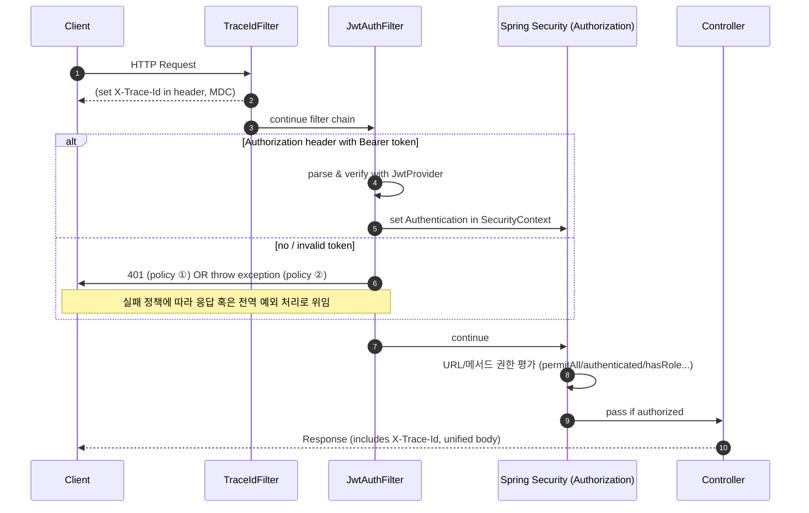

# 📖 Spring Boot 학습 정리 (B단계 ~ C단계)

<details>
<summary>B단계: 스프링 핵심 원리</summary>
### 1. 스프링 컨테이너와 빈 등록
스프링에서는 객체를 직접 생성하지 않고 `@Configuration` 클래스와 `@Bean` 메서드를 통해 **스프링 컨테이너**가 객체를 생성하고 관리합니다.  
이렇게 등록된 객체를 **스프링 빈(Bean)** 이라고 부릅니다.

- 장점: 객체 생명주기를 컨테이너가 관리 → 메모리 효율, 재사용성 증가
- 코드 예시:
```java
@Configuration
public class AppConfig {
    @Bean
    public MemberService memberService() {
        return new MemberServiceImpl();
    }
}
```

### 2. 싱글톤 패턴 vs 스프링 싱글톤
- **직접 구현한 싱글톤 패턴**  
  → 인스턴스를 하나만 만들도록 static 필드로 관리. 코드가 복잡하고 테스트 어려움.

- **스프링 싱글톤 컨테이너**  
  → 기본 스코프가 싱글톤이므로, 같은 빈을 여러 번 주입받아도 실제 객체는 1개.  
  개발자가 직접 싱글톤 패턴을 구현할 필요가 없음.

### 3. 의존관계 주입 (DI)
스프링이 객체 간 의존관계를 자동으로 연결해줌.  
**생성자 주입**이 가장 권장됨.

```java
@Service
public class MemberService {
    private final MemberRepository repository;

    @Autowired
    public MemberService(MemberRepository repository) {
        this.repository = repository;
    }
}
```

- 장점: 불변성 보장, 테스트 용이성 증가, 순환참조 방지

### 4. 스프링 MVC 요청 흐름
- `DispatcherServlet`이 모든 요청을 받아서 컨트롤러에 위임
- 컨트롤러 → 서비스 → 리포지토리 계층 순으로 실행
- 응답은 뷰 리졸버(ViewResolver) 또는 JSON 변환을 통해 클라이언트로 전달

### 5. HTTP 요청 데이터 처리
- `@RequestParam` : 단일 파라미터 매핑
- `@ModelAttribute` : 객체 바인딩
- `@RequestBody` : JSON 요청 매핑

### 6. HTTP 응답 처리
- `@ResponseBody` : 객체 → JSON 변환
- `@RestController` : `@Controller + @ResponseBody` 조합 → REST API 응답에 적합

---

## C단계: 기능 확장 & 고도화

### 1. JSON 응답 처리
스프링은 내부적으로 `HttpMessageConverter`(Jackson)를 사용하여 객체를 JSON으로 자동 변환합니다.

- 코드 예시:
```java
@RestController
public class MemberController {
    @GetMapping("/api/members")
    public List<Member> findAll() {
        return memberService.findAll();
    }
}
```

### 2. DTO와 응답 포맷 개선
엔티티를 직접 노출하지 않고 **DTO(Data Transfer Object)** 로 응답을 전달.  
추가로 공통 응답 포맷(`ApiResponse<T>`)을 정의하여 일관된 API 설계.

```json
{
  "status": 200,
  "message": "OK",
  "data": { ... },
  "traceId": "uuid",
  "timestamp": "2025-08-18T19:00:00"
}
```

### 3. Validation 적용
요청 DTO에 제약 조건을 추가해 유효성을 검증.

```java
public class MemberRequest {
    @NotBlank
    private String name;
}
```

- `@Valid`와 함께 사용 → 잘못된 요청 시 `MethodArgumentNotValidException` 발생
- 전역 예외 처리기로 잡아서 `ApiResponse` 포맷으로 반환

### 4. 제네릭 충돌 문제 (Void vs Object)
`ApiResponse.error()` 호출 시 제네릭 타입이 `Object`로 추론되는 문제 발생.  
해결 방법:
```java
ApiResponse<Void> body = ApiResponse.error(...);
return ResponseEntity.badRequest().body(body);
```

### 5. stream()의 역할
자바 스트림 API는 컬렉션 데이터를 선언적으로 처리하기 위한 기능.

```java
return memberService.findMembers().stream()
        .map(m -> new MemberResponse(m.getId(), m.getName()))
        .toList();
```

- 장점: 코드 간결성, 병렬 처리 지원

### 6. ResponseEntity의 역할
HTTP 응답을 세밀하게 제어 가능.

```java
return ResponseEntity
        .status(HttpStatus.CREATED)
        .header("X-Custom", "value")
        .body(responseDto);
```

- 상태 코드, 헤더, 바디를 자유롭게 설정 가능

---

## 운영 품질 개선

### 1. TraceId
- 요청마다 UUID를 생성하여 응답 JSON + 헤더(`X-Trace-Id`)에 추가
- 로그와 클라이언트를 연결해 장애 추적이 쉬움
- 마이크로서비스 환경에서는 분산 추적 필수 요소

### 2. RequestLoggingFilter
- 요청/응답 실행 시간, 상태코드, 바디 크기 등을 기록
- 슬로우 요청(SLOW) 감지 가능
- `FilterRegistrationBean`으로 순서 제어하여 traceId와 함께 동작

### 3. Filter를 Bean으로 등록한 이유
- 실행 순서 보장 (`order` 값)
- 운영 환경/테스트 환경에 따라 등록 유연성
- `@Component`보다 명시적으로 제어 가능

### 4. Filter vs Interceptor vs AOP
- **Filter**: HTTP 레벨 공통 기능 (traceId, 로깅, 인증)
- **Interceptor**: 컨트롤러 전후 (인증/인가)
- **AOP**: 서비스 계층 공통 관심사 (트랜잭션, 성능 모니터링)

---

## 추가 학습 질문 정리

- **traceId를 왜 사용하는가?**  
  → 요청 단위 추적, 장애 분석, 마이크로서비스 간 요청 흐름 추적

- **common 패키지 + WebConfig 등록 이유?**  
  → 전역 공통 기능 제공, 필터 실행 순서 보장, 운영환경별 관리 용이

- **ApiResponse.ErrorDetail 오류**  
  → 내부 클래스라면 `static` 선언 필요 (직렬화 오류 방지)

---
</details>

<details>
<summary>JWT_Auth_Flow</summary>

# JWT 인증 흐름 정리 (JwtAuthFilter · JwtProvider · SecurityConfig)

---

## 1) 요약

- **JwtProvider**: JWT **발급/검증** 유틸. 시크릿 키로 서명/검증, 클레임 추출.
- **JwtAuthFilter**: HTTP 요청에서 `Authorization: Bearer <JWT>` **파싱 → 검증 → SecurityContext 주입**.
- **SecurityConfig**: 시큐리티 **정책(인가 규칙, 세션/CSRF, 필터 순서)**을 정의.

---

## 2) 요청 1건의 처리 순서 (큰 그림)



> 권장 실패 정책: **필터에서 예외를 던져 전역 예외 처리기**가 공통 응답 포맷으로 변환하도록 구성(일관성 확보).

---

## 3) 구성요소별 역할 & 책임

### 3.1 JwtProvider — JWT 발급/검증 유틸리티

| 기능 | 설명 | 비고 |
|---|---|---|
| **createToken(subject, role, claims)** | `sub`, `role`, `iat`, `exp` 세팅 후 **서명**하여 문자열 토큰 발급 | JJWT 사용 (HMAC-SHA) |
| **parse(token)** | 시크릿 키로 **서명 검증**, 만료/위조/형식 오류 시 예외 | `Jws<Claims>` 반환 |
| **키 관리** | `application.yml/properties`의 `jwt.secret.key`로 Key 생성 | **최소 32바이트** 이상 권장 |
| **만료 설정** | `jwt.access-token-validity-seconds`로 토큰 만료 제어 | 운영 환경에서 짧게(예: 1h) |

**샘플 설정 (properties)**
```properties
jwt.secret.key=ThisIsADevOnlySecretKeyThatIsAtLeast32BytesLong!!!
jwt.access-token-validity-seconds=3600
```

---

### 3.2 JwtAuthFilter — 요청당 한 번 실행되는 인증 필터

| 단계 | 동작 | 결과 |
|---|---|---|
| 1 | `Authorization` 헤더 확인 (`Bearer <JWT>`) | 토큰 유무 판단 |
| 2 | `JwtProvider.parse()`로 검증 | 서명/만료/형식 검사 |
| 3 | 성공 시 `UsernamePasswordAuthenticationToken` 생성 | `SecurityContextHolder`에 **인증 객체 저장** |
| 4 | 실패 정책 | ① **즉시 401 응답** 또는 ② **예외 throw → 전역 핸들러 처리** |
| 5 | (선택) `MDC.put("user", username)` | 로그에 사용자 식별자 자동 포함 |

> 필터는 반드시 **`UsernamePasswordAuthenticationFilter` 앞**에 등록하여, 인가 단계 전에 인증을 완료하도록 한다.

---

### 3.3 SecurityConfig — 시큐리티 전반 정책

| 설정 | 내용 | 목적 |
|---|---|---|
| **Session = STATELESS** | 세션 비활성(Stateless) | JWT 형태에 적합 |
| **CSRF 비활성** | `csrf().disable()` | REST API 기본 |
| **인가 규칙** | `authorizeHttpRequests`로 **경로별 접근 정책** | 공개/보호 API 구분 |
| **필터 순서** | `addFilterBefore(new JwtAuthFilter, UsernamePasswordAuthenticationFilter.class)` | 표준 인증 전 JWT 인증 수행 |
| **CORS/예외 엔트리포인트** | 필요 시 추가 | 클라이언트/보안 정책 정교화 |

---

## 4) 케이스별 동작 요약

- **공개 API** (`permitAll`)
  - 토큰 없음: 그대로 통과 → 컨트롤러 실행
  - 토큰 있음: 검증 성공 시 인증된 사용자로 접근(컨트롤러에서 `Authentication` 활용 가능)

- **보호 API** (`authenticated`/`hasRole`)
  - 토큰 없음/무효: 인가 단계에서 401/403
  - 유효 토큰: 인증 객체 세팅 → 인가 통과 → 컨트롤러 실행

---

## 5) 운영 팁 & 체크리스트

- [ ] `jwt.secret.key`는 **32바이트 이상**(HMAC-SHA256) — 짧으면 `WeakKeyException` 유발
- [ ] 실패 정책을 **전역 예외 처리기**로 통일 → `ApiResponse` 포맷 유지
- [ ] `TraceIdFilter`를 **가장 먼저** 실행해 로그/응답에 traceId 포함
- [ ] 로깅에 **MDC(traceId, user)**를 써서 장애 추적 용이성 확보
- [ ] 보호/공개 경로의 **패턴 매칭**이 겹치지 않는지 확인
- [ ] 토큰/민감정보는 **로그 마스킹** 적용

---

## 6) 미니 예시 (요약 형태)

```java
// SecurityConfig (요약)
http.csrf(csrf -> csrf.disable())
    .sessionManagement(sm -> sm.sessionCreationPolicy(STATELESS))
    .authorizeHttpRequests(auth -> auth
        .requestMatchers("/api/auth/login", "/health").permitAll()
        .requestMatchers("/api/members/**").authenticated()
        .anyRequest().permitAll())
    .addFilterBefore(new JwtAuthFilter(jwtProvider), UsernamePasswordAuthenticationFilter.class);
```

```java
// JwtAuthFilter (요약)
protected void doFilterInternal(req, res, chain) {
  String header = req.getHeader("Authorization");
  if (hasBearer(header)) {
    var jws = jwtProvider.parse(token(header));
    var auth = new UsernamePasswordAuthenticationToken(jws.getPayload().getSubject(), null,
        List.of(new SimpleGrantedAuthority("ROLE_" + jws.getPayload().get("role", String.class))));
    SecurityContextHolder.getContext().setAuthentication(auth);
  }
  chain.doFilter(req, res);
}
```

```java
// JwtProvider (요약)
public String createToken(String username, String role) {
  Instant now = Instant.now();
  return Jwts.builder()
    .subject(username)
    .claim("role", role)
    .issuedAt(Date.from(now))
    .expiration(Date.from(now.plusSeconds(validity)))
    .signWith(key)
    .compact();
}
```

---

### 참고
- 토큰 실패를 **필터에서 직접 401로 쓰지 않고**, 커스텀 예외를 던져 전역 예외 처리기에서 공통 포맷으로 내려주는 방식이 더 낫다.
- 분산 추적을 계획한다면, `X-Trace-Id`와 **표준 trace 헤더**(W3C traceparent)를 병행 가능하다.

</details>

<details>
<summary>AOP_Execution_Logging</summary>

# AOP 기반 실행 시간 & 입력값 로깅 (Spring Boot)

## 1. 목표
- 메서드 실행 시간을 자동으로 측정하여 로깅한다.
- 입력값을 함께 기록하되, **민감 정보(password, token 등)는 마스킹 처리**한다.
- traceId와 연계하여 **장애 추적**을 쉽게 만든다.

---

## 2. 주요 컴포넌트

### 2.1 @LogExecutionTime (커스텀 애노테이션)
```java
@Target(ElementType.METHOD)
@Retention(RetentionPolicy.RUNTIME)
public @interface LogExecutionTime { }
```

→ 메서드 위에 붙이면 AOP가 동작한다.

### 2.2 LoggingAspect (AOP 구현체)
- `@Around` advice로 메서드 전후를 감싼다.
- 실행 시간 = `System.currentTimeMillis()`로 측정
- 입력 파라미터 로깅 시 민감 정보(`password`, `token`, `secret` 등)는 `***` 처리
- 반환값은 크면 타입만 기록
- traceId(MDC)에 함께 기록하여 로그 상관관계 추적 가능

```java
@Around("@annotation(com.example.solwith.aop.LogExecutionTime)")
public Object around(ProceedingJoinPoint pjp) throws Throwable {
    long start = System.currentTimeMillis();
    // ... 실행 전 로깅
    Object result = pjp.proceed();
    long took = System.currentTimeMillis() - start;
    // ... 실행 후 로깅
    return result;
}
```

---

## 3. 동작 순서

1. 클라이언트가 요청 → `TraceIdFilter`에서 traceId를 생성하고 MDC에 저장
2. 컨트롤러/서비스 메서드에 `@LogExecutionTime`이 있으면 `LoggingAspect`가 가로챈다
3. 메서드 실행 전: 파라미터를 문자열로 변환하여 로깅 (민감값은 `***`)
4. 실제 비즈니스 로직 실행 (`pjp.proceed()`)
5. 실행 후: 실행 시간(ms), 반환 타입, traceId와 함께 로깅
6. 예외 발생 시: 실행 시간 + 예외명 + 메시지를 warn 레벨로 기록

---

## 4. 로그 예시

```
[AOP] MemberService.findOne took=123ms traceId=abc-123 args=id=10 resultType=Member
[AOP] MemberService.join EX took=45ms traceId=abc-456 args=name=kim,password=*** ex=IllegalStateException:이미 존재
```

---

## 5. 적용 방법

### 5.1 서비스 메서드에 적용
```java
@LogExecutionTime
public Member findOne(Long id) {
    // ...
}
```

### 5.2 로그 패턴 설정 (logback-spring.xml)
```xml
<property name="PATTERN" value="[%d{yyyy-MM-dd HH:mm:ss.SSS}] %-5level [%X{traceId}] %logger{36} - %msg%n"/>
```

---

## 6. 운영 TIP

- **민감 정보 마스킹 규칙**: `password`, `token`, `secret`, `authorization` 등은 반드시 `***` 처리
- **traceId 연계**: 필수적으로 로그 패턴에 `%X{traceId}`를 포함시켜야 한다.
- **AOP 적용 범위**: 서비스/레포지토리/외부 연동 호출에 주로 붙여서 성능/장애 모니터링에 활용
- **Spring Boot AOP Starter** 사용 시 `@EnableAspectJAutoProxy`는 필요 없음.
- 반환값이 큰 객체는 타입명만 출력하여 로그 오염 방지.

---

## 7. 체크리스트

- [ ] `@LogExecutionTime`이 필요한 메서드에 붙였는가?
- [ ] 로그 패턴에 `%X{traceId}`가 들어갔는가?
- [ ] 민감 파라미터 마스킹이 잘 되는가?
- [ ] 반환값 로그가 과도하게 크지 않은가?
- [ ] 예외 발생 시 warn/error 레벨로 기록되는가?

---

## 8. 결론

- `@LogExecutionTime` + `LoggingAspect`를 통해 **운영 가시성**을 확보할 수 있다.
- traceId + 실행 시간 + 입력값/반환값을 로그에 남겨 **장애 분석과 성능 최적화**에 큰 도움이 된다.
</details>

<details>
<summary>메서드 보안<@PreAuthorize> + 역할 계층<Role Hierarchy></summary>

# 메서드 보안(@PreAuthorize) & 역할 계층(Role Hierarchy) 완전 정복

> Spring Boot 3 / Spring Security 6 기준.  
> **메서드 보안 활성화 → 역할 계층 적용 → JWT 권한 주입 → 소유권(Ownership) 검사 → HTTP 보안과의 병행 사용**

---

## 1) 핵심 개념

- **@PreAuthorize**: 메서드 호출 **직전**에 SpEL로 접근 조건 평가. (권한/로그인 여부/파라미터 기반)
- **Role Hierarchy**: `ROLE_ADMIN > ROLE_MANAGER > ROLE_USER`처럼 **상위 역할이 하위 역할을 포함**하도록 하는 기능.
- **HTTP 보안 vs 메서드 보안**:
  - **HTTP 보안**은 URL 경로 레벨의 1차 장벽(대략적인 공개/보호 구분).
  - **메서드 보안**은 서비스/컨트롤러 메서드 레벨의 2차 장벽(정밀 권한/소유권 검사).
  - 둘은 **독립적으로** 작동하며, **둘 다 통과**해야 최종 실행된다.

---

## 2) 기본 설정

### 2.1 메서드 보안 활성화
```java
// src/main/java/com/example/solwith/auth/SecurityConfig.java
@Configuration
@EnableWebSecurity
@EnableMethodSecurity(prePostEnabled = true) // ✅ @PreAuthorize/@PostAuthorize 활성화
public class SecurityConfig {
    // 기존 http 설정 + JwtAuthFilter 등록
}
```

### 2.2 역할 계층 등록 (신규 방식: fromHierarchy)
```java
// src/main/java/com/example/solwith/auth/MethodSecurityConfig.java
@Configuration
public class MethodSecurityConfig {

    // ADMIN > MANAGER > USER (위 역할이 아래 역할을 “상속”)
    @Bean
    static org.springframework.security.access.hierarchicalroles.RoleHierarchy roleHierarchy() {
        return org.springframework.security.access.hierarchicalroles.RoleHierarchyImpl.fromHierarchy(
            """
            ROLE_ADMIN > ROLE_MANAGER
            ROLE_MANAGER > ROLE_USER
            """
        );
    }

    // @PreAuthorize 해석기에 역할 계층을 적용
    @Bean
    static org.springframework.security.access.expression.method.MethodSecurityExpressionHandler
    methodSecurityExpressionHandler(org.springframework.security.access.hierarchicalroles.RoleHierarchy roleHierarchy) {
        var handler = new org.springframework.security.access.expression.method.DefaultMethodSecurityExpressionHandler();
        handler.setRoleHierarchy(roleHierarchy);
        return handler;
    }
}
```

> **주의:** Spring Security 6부터 `new RoleHierarchyImpl()` 기본 생성자 대신 `fromHierarchy(...)` 사용 권장.  
> 모든 권한 문자열은 관례상 **`ROLE_` 접두사**를 사용한다.

---

## 3) JWT ↔ 권한(Authorities) 매핑 패턴

JWT에 담긴 클레임을 `GrantedAuthority`로 변환해 `SecurityContext`에 주입해야 @PreAuthorize가 동작한다.  
(우리 예제는 `JwtAuthFilter`에서 수행)

### 3.1 단일 역할(String) 사용
**JWT Claims**
```json
{
  "sub": "alice",
  "role": "ADMIN"
}
```
**필터 변환**
```java
String role = claims.get("role", String.class); // "ADMIN"
List<GrantedAuthority> auths = List.of(new SimpleGrantedAuthority("ROLE_" + role));

var auth = new UsernamePasswordAuthenticationToken(username, null, auths);
SecurityContextHolder.getContext().setAuthentication(auth);
```

### 3.2 다중 역할(List<String>) 사용
**JWT Claims**
```json
{
  "sub": "bob",
  "roles": ["USER","MANAGER"]
}
```
**필터 변환**
```java
List<String> roles = claims.get("roles", List.class); // ["USER","MANAGER"]
List<GrantedAuthority> auths = roles.stream()
    .map(r -> new SimpleGrantedAuthority("ROLE_" + r))
    .toList();
SecurityContextHolder.getContext().setAuthentication(
    new UsernamePasswordAuthenticationToken(username, null, auths));
```

### 3.3 이미 `ROLE_` 접두사가 붙은 경우
**JWT Claims**
```json
{ "sub": "carol", "roles": ["ROLE_USER","ROLE_MANAGER"] }
```
**필터 변환**
```java
List<String> roles = claims.get("roles", List.class);
List<GrantedAuthority> auths = roles.stream()
    .map(SimpleGrantedAuthority::new) // 이미 ROLE_ 접두사 포함
    .toList();
```

### 3.4 (선택) 계층 확장 적용 – HTTP 단계까지 확실히 반영
```java
// 필터에서 상위 → 하위 권한 확장
List<GrantedAuthority> base = auths;
Collection<? extends GrantedAuthority> expanded =
        roleHierarchy.getReachableGrantedAuthorities(base);

var auth = new UsernamePasswordAuthenticationToken(username, null, expanded);
SecurityContextHolder.getContext().setAuthentication(auth);
```

> 이렇게 하면, 예컨대 `ROLE_ADMIN` 토큰이 자동으로 `ROLE_MANAGER`, `ROLE_USER` 권한도 포함하게 된다.

---

## 4) @PreAuthorize 실전 패턴 모음

### 4.1 단순 역할 검사
```java
@PreAuthorize("hasRole('ADMIN')")
public void deleteMember(Long id) { ... }

@PreAuthorize("hasAnyRole('MANAGER','ADMIN')")
public List<Member> listAll() { ... }

@PreAuthorize("isAuthenticated()")
public Member myProfile() { ... }
```

### 4.2 소유권(Ownership) 검사 — 다양한 경우의 수

#### (A) JWT `sub`에 **username**이 들어있는 경우
- `JwtAuthFilter`에서 principal을 **username**으로 설정했다면:  
  `authentication.name` == username

```java
@PreAuthorize("#username == authentication.name")
public Member getByUsername(String username) { ... }
```

#### (B) JWT `sub`에 **userId(Long)** 가 들어있는 경우
- principal이 문자열(username)이라면 비교 형 변환 필요
```java
@PreAuthorize("#userId.toString() == authentication.name") 
public Order getMyOrder(Long userId, Long orderId) { ... }
```
- 또는 principal 자체를 userId로 저장하는 방식도 가능
```java
// 필터에서 principal을 userId(Long)로 저장했다면:
@PreAuthorize("#userId == principal") 
public Order getMyOrder(Long userId, Long orderId) { ... }
```

#### (C) 커스텀 Principal 객체 사용 (권장)
- 필터에서 `new UsernamePasswordAuthenticationToken(customPrincipal, null, auths)`로 주입
- 커스텀 객체에 `id`, `username`, `roles` 등 보유
```java
@PreAuthorize("#memberId == principal.id") 
public Member getMyMember(Long memberId) { ... }
```

#### (D) 도메인 레벨 체크(레포지토리 질의) — @bean 메서드 호출
- SpEL에서 **빈 메서드**를 호출하여 DB로 소유권 판단
```java
@PreAuthorize("@memberSecurity.isOwner(#memberId, authentication.name)")
public Member getMember(Long memberId) { ... }

@Component
public class MemberSecurity {
  private final MemberRepository repo;
  public boolean isOwner(Long memberId, String username) {
    return repo.existsByIdAndUsername(memberId, username);
  }
}
```

### 4.3 반환값 기반 검사 — @PostAuthorize
- 메서드가 반환한 객체의 소유자만 접근 허용
```java
@PostAuthorize("returnObject.ownerUsername == authentication.name")
public Document getDoc(Long id) { ... }
```

> **TIP:** 소유권 검사는 **서비스 계층**에도 중복으로 거는 게 안전합니다(컨트롤러 우회 호출 방지).

---

## 5) HTTP 보안 규칙(선택) + 메서드 보안 함께 쓰기

### 5.1 추천 구성
```java
http
  .csrf(csrf -> csrf.disable())
  .sessionManagement(sm -> sm.sessionCreationPolicy(SessionCreationPolicy.STATELESS))
  .authorizeHttpRequests(auth -> auth
      .requestMatchers("/api/auth/login", "/health").permitAll() // 공개
      .anyRequest().authenticated() // 그 외엔 인증 필요(1차 장벽)
  )
  .addFilterBefore(new JwtAuthFilter(jwtProvider), UsernamePasswordAuthenticationFilter.class);
```
- URL 레벨에서는 **대략적인 공개/보호**만 나눈다.
- **정밀 권한/소유권**은 `@PreAuthorize`로 제어(2차 장벽).

### 5.2 FAQ
- `permitAll()`이어도 메서드에 `@PreAuthorize`가 있으면? → **차단**된다(메서드 보안이 별도로 적용).
- 반대로 URL에서 `authenticated()`인데 메서드에 조건이 없다면? → **인증만 있으면 통과**한다.
- **둘 다 통과해야** 실제 실행.

---

## 6) 테스트 시나리오 (빠른 검증)

1. 토큰 없음 → `@PreAuthorize("isAuthenticated()")` 메서드 호출 시 **401 또는 403**
2. `ROLE_USER` 토큰 → `hasRole('USER')` 메서드 **200**
3. `ROLE_MANAGER` 토큰 → `hasRole('USER')` 메서드 **200** (계층 상속)
4. `ROLE_USER` 토큰 → `hasRole('ADMIN')` 메서드 **403**
5. 소유권 검사: 본인은 **200**, 타인은 **403**
6. `@PostAuthorize` 반환값 검사: 소유자 외에는 **403**

---

## 7) 흔한 오류 & 체크리스트

- [ ] `@EnableMethodSecurity(prePostEnabled = true)`를 켰는가?
- [ ] 권한 문자열에 **`ROLE_` 접두사**를 사용했는가?
- [ ] `RoleHierarchyImpl.fromHierarchy(...)`로 **계층을 등록**했는가?
- [ ] `DefaultMethodSecurityExpressionHandler#setRoleHierarchy(...)`로 **메서드 보안에 계층 적용**했는가?
- [ ] JWT 필터에서 **권한을 올바로 주입**했는가? (단일/다중/ROLE_ 여부)
- [ ] 커스텀 Principal 또는 SpEL bean 호출로 **소유권 판단**이 정확한가?
- [ ] URL 규칙과 메서드 보안이 **중복/충돌 없이** 조합되는가?

---

## 8) 미니 예시 모음

**서비스 예시**
```java
@Service
public class MemberService {

  @PreAuthorize("hasRole('ADMIN')")
  public void deleteMember(Long id) { ... }

  @PreAuthorize("isAuthenticated()")
  public Member myProfile() { ... }

  // 소유권: JWT sub가 username인 경우
  @PreAuthorize("#username == authentication.name")
  public Member getByUsername(String username) { ... }

  // 소유권: 커스텀 Principal 객체 사용
  @PreAuthorize("#memberId == principal.id")
  public Member getMyMember(Long memberId) { ... }

  // 도메인 체크: 레포지토리 질의
  @PreAuthorize("@memberSecurity.isOwner(#memberId, authentication.name)")
  public Member secureGet(Long memberId) { ... }
}
```

**JwtAuthFilter 요약**
```java
var claims = jwtProvider.parse(token).getPayload();
String username = claims.getSubject(); // sub
List<String> roles = claims.get("roles", List.class); // 또는 "role" 단일

List<GrantedAuthority> auths = (roles != null ? roles : List.of())
    .stream().map(r -> r.startsWith("ROLE_") ? r : "ROLE_" + r)
    .map(SimpleGrantedAuthority::new).toList();

// (선택) 계층 확장
var expanded = roleHierarchy.getReachableGrantedAuthorities(auths);

var auth = new UsernamePasswordAuthenticationToken(username, null, expanded);
SecurityContextHolder.getContext().setAuthentication(auth);
```

---

### 결론
- **URL 보안(1차)** + **메서드 보안(2차)** 조합으로 다층 방어를 구축하면 좋다.
- **역할 계층**을 통해 권한 관리를 단순화하고,
- **소유권 검사**로 세밀한 접근 제어를 완성하면 탄탄한 보안 구조가 완성된다.
</details>

## DB_Lock
<details>
<summary>DB-Lock 개념</summary>

# 데이터베이스 락(Database Locks) 완전 정리

> Spring Boot 3 / JPA(Jakarta) / Hibernate 6 기준

---

## 1) 왜 락이 필요한가? — 동시성 이상(Anomalies)

동시에 여러 트랜잭션이 같은 데이터를 읽고/쓰기 하면 아래 문제가 발생할 수 있다.

- **Dirty Read**: 커밋되지 않은 값을 다른 트랜잭션이 읽음
- **Non‑repeatable Read**: 같은 트랜잭션 내에서 같은 행을 두 번 읽을 때 값이 달라짐
- **Phantom Read**: 같은 조건으로 읽을 때 행의 개수가 달라짐(새로운 행이 나타남/사라짐)
- **Lost Update**: 서로 덮어써서 한쪽 업데이트가 사라짐 → 실무에서 가장 피해가 큼

> 해결책은 **적절한 격리수준(Isolation Level)** + **락** + **낙관/비관 전략**의 조합이다.

---

## 2) 격리수준(Isolation)과 MVCC의 관계

- **MVCC**(Multi‑Version Concurrency Control): 대부분의 RDB(PostgreSQL, MySQL InnoDB)가 채택.  
  읽기는 스냅샷을 보고, 쓰기는 버전을 새로 만들어 충돌을 완화.
- 격리수준(낮→높):
  1) **READ UNCOMMITTED**
  2) **READ COMMITTED** (PostgreSQL 기본)
  3) **REPEATABLE READ** (MySQL InnoDB 기본)
  4) **SERIALIZABLE** (가장 엄격, 성능 비용 큼)

> 격리수준만으로 모든 충돌을 막기 어렵다. **Lost Update**는 보통 **락** 또는 **낙관적 락**으로 해결한다.

---

## 3) 락의 분류 (학습 지도)

### 3.1 행위 기준
- **공유 락(Shared, S)**: 다른 트랜잭션도 **읽기**는 가능, **쓰기**는 불가
- **배타 락(Exclusive, X)**: **읽기/쓰기 모두 차단**, 나만 씀
- **업데이트 락(Update, U)**: (주로 SQL Server) S→X 전환 충돌 방지용
- **의도 락(Intent, IS/IX/SIX)**: 상위 객체(테이블)에 “하위에 락 있음”을 표시하는 메타 락

### 3.2 범위 기준
- **Row(레코드) 락**: 가장 세밀, 실무 기본
- **Page/Page‑Range 락**: 일부 엔진에서 사용
- **Table 락**: 테이블 전체
- **Gap/Next‑Key 락**: MySQL InnoDB가 특정 범위(갭)까지 잠굼(팬텀 방지)

### 3.3 전략 기준
- **비관적 락(Pessimistic)**: “충돌 날 것”이라 보고 **미리** 잠금 (예: `SELECT ... FOR UPDATE`)
- **낙관적 락(Optimistic)**: “잘 안 날 것”이라 보고 **커밋 시점**에 버전 충돌 검사 (`@Version`)

### 3.4 특수
- **Advisory Lock**(PostgreSQL): 애플리케이션 레벨 사용자 정의 락(키 기반)

---

## 4) 비관적 락 (Pessimistic Lock)

### 4.1 SQL 예시

#### MySQL InnoDB
```sql
-- 쓰기 의도: 해당 행 X-락 (다른 트랜잭션의 읽기/쓰기 제한)
SELECT * FROM product WHERE id = 10 FOR UPDATE;

-- 읽기 공유: S-락 (다른 트랜잭션은 쓰기 불가)
SELECT * FROM product WHERE id = 10 LOCK IN SHARE MODE; -- (MySQL 8.0 이하 구문)
-- MySQL 8+에서는 FOR SHARE 사용 가능
SELECT * FROM product WHERE id = 10 FOR SHARE;
```

#### PostgreSQL
```sql
SELECT * FROM product WHERE id = 10 FOR UPDATE;         -- X-락
SELECT * FROM product WHERE id = 10 FOR NO KEY UPDATE;  -- 키 변경만 막음
SELECT * FROM product WHERE id = 10 FOR SHARE;          -- 공유 락
SELECT * FROM product WHERE id = 10 FOR KEY SHARE;      -- FK 참조 키 보호
```

> **주의(MySQL)**: 인덱스 미활용/범위 조건일 때 **갭/넥스트키 락**으로 더 넓게 잠길 수 있어요. 인덱스 설계를 꼼꼼히!

### 4.2 Spring Data JPA 예시 (Jakarta API)

```java
public interface ProductRepository extends JpaRepository<Product, Long> {

    // 행 쓰기 락 (업데이트 의도)
    @Lock(jakarta.persistence.LockModeType.PESSIMISTIC_WRITE)
    @QueryHints(@jakarta.persistence.QueryHint(name = "jakarta.persistence.lock.timeout", value = "3000")) // ms
    @Query("select p from Product p where p.id = :id")
    Optional<Product> findByIdForUpdate(@Param("id") Long id);

    // 공유 락
    @Lock(jakarta.persistence.LockModeType.PESSIMISTIC_READ)
    @Query("select p from Product p where p.id = :id")
    Optional<Product> findByIdForShare(@Param("id") Long id);
}
```

서비스 트랜잭션:
```java
@Service
public class StockService {

    @Transactional
    public void decrease(Long productId, int qty) {
        Product p = repo.findByIdForUpdate(productId)
                        .orElseThrow(() -> new NotFoundException("product"));

        if (p.getStock() < qty) throw new IllegalStateException("재고 부족");
        p.setStock(p.getStock() - qty);
        // flush/commit 시 UPDATE 실행
    }
}
```

**장점**: 충돌 즉시 차단 → Lost Update 방지에 확실  
**단점**: 대기/교착 가능성, 스루풋 저하

---

## 5) 낙관적 락 (Optimistic Lock)

**아이디어**: 테이블에 `version` 컬럼을 두고, `UPDATE ... WHERE id=? AND version=?`처럼 **버전을 조건에 포함**.  
영향 행이 0이면 누군가 먼저 바꾼 것 → **충돌 예외**.

### 5.1 JPA 매핑
```java
@Entity
public class Product {
    @Id @GeneratedValue
    private Long id;

    private int stock;

    @Version                 // ✅ 버전 필드
    private Long version;    // Long/Integer/Timestamp 가능
}
```

### 5.2 동작
- 트랜잭션 T1, T2가 같은 행을 읽음(버전=5)
- T1이 업데이트 시도 → `where id=? and version=5`로 성공, 버전=6으로 증가
- T2가 업데이트 시도 → `where id=? and version=5`가 **영향 없음** → `OptimisticLockException` 발생
- 보통 **재시도 로직**(retry with backoff)을 둔다.

### 5.3 언제 쓰나?
- **경합이 낮은** 읽기 중심 시스템(마이페이지, 설정 변경 등)
- 과도한 락 대기를 피하고 **스루풋**을 얻고 싶을 때

**주의**: 실패 시 **예외 처리/재시도**가 설계에 반드시 들어가야 함.

---

## 6) Lost Update 방지 전략 비교

| 전략 | 방법 | 장점 | 단점 | 추천 상황 |
|---|---|---|---|---|
| 비관적 락 | `FOR UPDATE` / PESSIMISTIC_WRITE | 충돌 즉시 차단, 단순 | 대기/교착, throughput 하락 | 고경합, 금전/재고 같이 **꼭** 지켜야 하는 자원 |
| 낙관적 락 | `@Version` | 락 대기 없음, 고성능 | 충돌 시 예외 → 재시도 필요 | 경합이 낮은 업데이트, 사용자 설정/게시글 수정 등 |

---

## 7) 교착상태(Deadlock)와 타임아웃

- **Deadlock**: 서로가 서로의 락을 기다리는 상태 (A가 a→b 순서로, B가 b→a 순서로 락 요청 등)
- **예방법**
  - **락 획득 순서**를 서비스 전반에서 **일관**되게
  - 트랜잭션을 **짧게**, 필요한 최소 범위만 잠금
  - **인덱스** 설계로 스캔 범위를 줄여 **갭/넥스트키** 락 최소화(MySQL)
  - 타임아웃 설정: `jakarta.persistence.lock.timeout`, DB의 `lock_wait_timeout`/`deadlock_timeout`

- **대응**
  - DB가 Deadlock을 감지하면 한쪽을 실패시킴 → 어플리케이션에서 **재시도**

---

## 8) DB별 특징 (요약)

### MySQL InnoDB
- 기본 격리수준 **REPEATABLE READ**
- **Next‑Key Lock**(레코드 + 갭)으로 팬텀을 방지
- 인덱스 미사용 시 잠금 범위가 넓어질 수 있음 → **적절한 인덱스** 중요

### PostgreSQL
- 기본 격리수준 **READ COMMITTED**
- 강력한 **MVCC**: 읽기는 보통 다른 트랜잭션을 블로킹하지 않음
- `FOR UPDATE / FOR NO KEY UPDATE / FOR SHARE / FOR KEY SHARE` 세분화
- **Advisory Lock** 제공: `pg_advisory_lock(key)`

---

## 9) Spring 트랜잭션 옵션과 함께 쓰기

```java
@Service
public class OrderService {

    // 격리수준을 조절하고 싶을 때 (DB/업무 특성에 맞춤)
    @Transactional(isolation = Isolation.REPEATABLE_READ, timeout = 5)
    public void placeOrder(Long productId) {
        // 재고 차감은 비관적 락으로
        Product p = repo.findByIdForUpdate(productId).orElseThrow();
        // ...
    }
}
```

- `timeout`(초)로 긴 대기/교착 시 빠르게 탈출
- 격리수준은 DB 기본을 따르되, 핵심 로직에만 필요시 상향

---

## 10) 실무 체크리스트

- [ ] **핵심 자원**(재고, 포인트, 잔액)은 비관적 락 or 낙관적 + 재시도
- [ ] 동일 자원 잠금 **순서 일관성**
- [ ] 트랜잭션 **짧게**, 비즈니스/외부 호출 분리
- [ ] MySQL은 **인덱스 필수**, 범위 조건 잠금 범위 유의
- [ ] **락/쿼리 타임아웃** 명시로 장애 영향 축소
- [ ] 낙관적 락은 **재시도 전략** 포함(backoff)
- [ ] 모니터링: 락 대기/교착 지표, 슬로우 쿼리, 타임아웃 로그
- [ ] 부하/경합 시나리오로 **부하 테스트** 필수

---

## 11) 상황별 선택 가이드

- **업데이트 경합 낮음**: `@Version`(낙관) + 재시도 → 고성능
- **경합 높고 반드시 보장**: `FOR UPDATE`(비관) → 안전성 우선
- **읽기 많은 조회 API**: 락 없이 MVCC로 처리 + 필요 시 캐시
- **범위 삽입 충돌 방지(MySQL)**: 적절한 인덱스 + 트랜잭션 내 `FOR UPDATE`로 “갭” 보호
- **복잡한 소유권/검증**: DB 제약(UNIQUE/FK/체크) + 서비스 락 조합

---

## 12) 미니 예제(정리)

### 12.1 비관적 락 기반 재고 차감
```java
@Transactional
public void purchase(Long productId, int qty) {
    Product p = repo.findByIdForUpdate(productId)
                    .orElseThrow(() -> new NotFoundException("not found"));
    if (p.getStock() < qty) throw new IllegalStateException("재고 부족");
    p.setStock(p.getStock() - qty);
}
```

### 12.2 낙관적 락 기반 재고 차감 (+재시도)
```java
@Transactional
public void purchaseOptimistic(Long productId, int qty) {
    for (int attempt = 1; attempt <= 3; attempt++) {
        try {
            Product p = repo.findById(productId).orElseThrow();
            if (p.getStock() < qty) throw new IllegalStateException("재고 부족");
            p.setStock(p.getStock() - qty);
            return; // commit 시 @Version 검사 통과하면 성공
        } catch (jakarta.persistence.OptimisticLockException e) {
            if (attempt == 3) throw e;
            try { Thread.sleep(50L * attempt); } catch (InterruptedException ignored) {}
        }
    }
}
```

---

### 결론
- 락은 **정확성**과 **성능** 사이의 트레이드오프다.
- **경합/업무 중요도/DB 특성**을 기준으로 **비관/낙관**을 골라 적용하고,
- 인덱스/격리/타임아웃/재시도/모니터링을 함께 설계하면 **안전하고 빠른 시스템**을 만들 수 있다.

</details>
<details>
<summary>Optimistic Lock</summary>

# MySQL에서 낙관적 락(Optimistic Lock) 정리

> Spring Boot 3 · Hibernate 6 · MySQL 8

---

## 1. 낙관적 락이란?

- 실제 DB에 락을 거는 대신, **버전 컬럼(@Version)** 으로 동시성 충돌을 감지
- UPDATE 시 `where id=? and version=?` 조건을 포함 → 영향 행이 없으면 **충돌 예외 발생**
- **장점**: 락 대기 없음 → 성능 유리
- **단점**: 충돌 시 예외 발생 → 재시도 필요

---

## 2. 엔티티 설계

```java
@Entity
public class Product {
    @Id @GeneratedValue
    private Long id;

    private int stock;

    @Version   // ✅ 낙관적 락 버전 필드
    private Long version;

    public void decrease(int qty) {
        if (stock < qty) throw new IllegalStateException("재고 부족");
        this.stock -= qty;
    }
}
```

**왜 필요한가?**
- `@Version`이 없다면 JPA는 단순히 `update ... where id=?`만 실행
- 동시에 두 트랜잭션이 같은 데이터를 수정해도 **둘 다 성공 → Lost Update 발생**
- `@Version`은 충돌을 감지하고 예외를 던져줌

---

## 3. 서비스 설계

### 단발 시도
```java
@Transactional
public void decreaseOnce(Long id, int qty) {
    Product p = repo.findById(id).orElseThrow();
    p.decrease(qty); // flush 시점에 버전 체크
}
```

- **설명**: 단 한 번만 시도 → 충돌 시 `ObjectOptimisticLockingFailureException` 발생

### 재시도 로직
```java
public void decreaseWithRetry(Long id, int qty) {
    for (int attempt = 1; attempt <= 5; attempt++) {
        try {
            command.decreaseOnce(id, qty); // REQUIRES_NEW 트랜잭션
            return; // 성공하면 종료
        } catch (ObjectOptimisticLockingFailureException e) {
            if (attempt == 5) throw e;
            Thread.sleep(50 * attempt); // 백오프 후 재시도
        }
    }
}
```

- **설명**: 충돌이 나면 일정 횟수만큼 재시도 → 결국 두 스레드 모두 성공할 수 있음
- **포인트**: 각 시도는 `REQUIRES_NEW` 트랜잭션으로 실행해야 커밋 시점에 충돌이 잡힘

---

## 4. 테스트 시나리오

1) **단발 시도**
- 두 스레드가 동시에 `decreaseOnce(5)` 실행
- 한쪽은 성공, 다른 한쪽은 충돌 예외
- 최종 재고 = 5

2) **재시도**
- 두 스레드가 동시에 `decreaseWithRetry(5)` 실행
- 처음엔 충돌 나더라도 재시도 끝에 둘 다 성공
- 최종 재고 = 0

---

## 5. 실패 원인 & 해결책

- **문제**: 처음 구현에서 `decreaseWithRetry()` 내부에서 같은 빈의 `@Transactional(REQUIRES_NEW)` 메서드를 직접 호출 → 프록시를 거치지 않아 트랜잭션이 열리지 않음
- **증상**: 예외를 잡지 못하고 최종 재고가 그대로 10으로 남음
- **해결**: 별도 빈(`ProductCommand`)으로 분리 → 다른 빈을 통해 호출하면 프록시가 적용되어 `REQUIRES_NEW` 정상 동작

---

## 6. 요약 & 팁

- `@Version` 필드 → 낙관적 락 충돌 감지
- 충돌 시 예외 → 반드시 재시도 정책 필요
- 재시도는 **트랜잭션 바깥**에서, 시도는 **REQUIRES_NEW**로 실행
- 동시성 테스트는 **CountDownLatch** 등으로 실제 경합 상황을 만들어야 함
- 실무에서는 **재시도 + 백오프 + 모니터링(충돌 빈도)**까지 설계

---

### 결론

낙관적 락은 성능은 좋지만 설계 실수가 많다.  
특히 **트랜잭션 경계**와 **프록시 호출**을 정확히 이해해야 올바르게 동작한다.  
이번 구조(별도 빈 + REQUIRES_NEW + 재시도)는 실무에서 그대로 활용 가능한 안정적인 패턴이다.

</details>

## Annotaion 정리
<details>
<summary>Annotation</summary>

# Spring Boot 실무 어노테이션 가이드 (핵심 + 용도별 정리)

> Spring Boot 3.x / Spring Framework 6.x 기준

---

## 0) 한눈에 보기 (Cheat Sheet)

| 목적 | 대표 어노테이션 | 핵심 요약 |
|---|---|---|
| 앱 부트스트랩 | `@SpringBootApplication` | 컴포넌트 스캔 + 자동설정 + 부트 설정 통합 |
| 빈 등록/DI | `@Component`, `@Service`, `@Repository`, `@Configuration`, `@Bean`, `@Autowired`, `@Qualifier`, `@Primary`, `@Lazy`, `@Value` | 스테레오타입 + 수동 빈 등록 + 주입/선정/지연 |
| 구성/프로퍼티 | `@ConfigurationProperties`, `@EnableConfigurationProperties`, `@Profile` | yml/properties → 타입세이프 바인딩, 프로파일 분기 |
| 웹 MVC/REST | `@RestController`, `@Controller`, `@RequestMapping`(`@GetMapping` 등), `@PathVariable`, `@RequestParam`, `@RequestBody`, `@ResponseStatus`, `@ControllerAdvice`/`@RestControllerAdvice`, `@ExceptionHandler`, `@CrossOrigin` | API 엔드포인트/바인딩/예외 처리/CORS |
| 검증 | `@Valid`, `@Validated`, (Jakarta) `@NotNull`, `@NotBlank`, `@Size` 등 | 요청 DTO/엔티티 제약조건 검증 |
| 영속성(JPA) | `@Entity`, `@Id`, `@GeneratedValue`, `@Column`, 관계 매핑(`@OneToMany` 등), `@Version` | 엔티티 매핑/버전(낙관적 락) |
| Spring Data | `@Repository`, `@EnableJpaRepositories`, `@Query`, `@Modifying`, `@Lock`, `@EntityGraph`, **감사**: `@CreatedDate`, `@LastModifiedDate`, `@EnableJpaAuditing` | 리포지토리/쿼리/락/페치전략/감사 |
| 트랜잭션 | `@Transactional`, `@EnableTransactionManagement` | 경계/전파/격리/읽기전용/롤백 규칙 |
| 캐시 | `@EnableCaching`, `@Cacheable`, `@CachePut`, `@CacheEvict`, `@Caching` | 메서드 레벨 캐싱 |
| AOP | `@Aspect`, `@Around`/`@Before` 등 | 횡단 관심사(로깅/추적/권한 등) |
| 보안 | `@EnableWebSecurity`, `@EnableMethodSecurity`, `@PreAuthorize`, `@PostAuthorize`, `@RolesAllowed` | URL/메서드 보안 |
| 스케줄/비동기 | `@EnableScheduling`, `@Scheduled`, `@EnableAsync`, `@Async` | 크론 작업/쓰레드 풀 비동기 |
| 테스트 | `@SpringBootTest`, `@DataJpaTest`, `@WebMvcTest`, `@MockBean`, `@SpyBean`, `@AutoConfigureMockMvc`, `@ActiveProfiles`, `@Sql`, `@TestConfiguration` | 슬라이스/통합 테스트/목 주입 |
| 문서화(OpenAPI) | `@Operation`, `@ApiResponse`, `@Schema`, `@Parameter`, `@Tag` (springdoc-openapi) | API 스펙/스웨거 UI 노출 |

---

## 1) 앱 부트스트랩 & 구성

### `@SpringBootApplication`
- = `@SpringBootConfiguration` + `@EnableAutoConfiguration` + `@ComponentScan`
- **왜**: 스캔/자동설정/부트 설정을 한 번에. 일반적으로 **최상위 패키지 루트**에 배치하여 하위 패키지 전부 스캔.

### `@Configuration`
- 자바 기반 설정 클래스. 내부 `@Bean` 메서드 정의.
- **주의**: `proxyBeanMethods=false`(기본 true)로 변경 시, `@Bean` 간 참조가 단순 메서드 호출이 되어 **싱글톤 보장에 영향** 있을 수 있음.

### `@Bean`
- 수동 빈 등록.
- **왜**: 라이브러리 객체, 팩토리 생성 등 자동 스캔 어려운 경우.

### `@Profile("dev")`
- 특정 프로파일에서만 빈 등록/설정 적용.

---

## 2) 빈 등록 & 의존성 주입

### 스테레오타입
- `@Component`(일반), `@Service`(서비스 계층 의미 부여), `@Repository`(데이터 예외 변환), `@Controller`/`@RestController`(웹)
- **왜**: 역할 명확화 + 스캔 대상.

### 주입/선정
- `@Autowired`(필드/생성자/세터), **권장**: 생성자 주입 + `@RequiredArgsConstructor`(롬복)
- `@Qualifier("name")` / `@Primary` : 동일 타입 여러 빈일 때 선택
- `@Lazy` : 순환참조 회피/지연 초기화
- `@Value("${...}")` : 단건 프로퍼티 주입(복잡 바인딩은 `@ConfigurationProperties` 권장)

---

## 3) 프로퍼티 바인딩 & 환경

### `@ConfigurationProperties(prefix="app")`
```java
@ConfigurationProperties(prefix="app")
public record AppProps(String name, int poolSize) {}
```
- **왜**: 타입 세이프, 계층 구조 바인딩, IDE 자동완성.
- 함께: `@EnableConfigurationProperties(AppProps.class)` 또는 빈으로 등록.

### `@PropertySource`
- 외부 properties 파일 추가(요즘은 yml 사용이 일반적).

---

## 4) 웹 MVC & REST

### 컨트롤러
- `@RestController` = `@Controller` + `@ResponseBody`(메시지 컨버터로 JSON 등 직렬화)
- `@RequestMapping`(클래스/메서드), 축약형: `@GetMapping`/`@PostMapping`/`@PutMapping`/`@DeleteMapping`/`@PatchMapping`
- 파라미터 바인딩: `@PathVariable`, `@RequestParam`, `@RequestHeader`, `@CookieValue`, `@RequestBody`, `@ModelAttribute`
- 응답: `@ResponseStatus`, `ResponseEntity<T>`

### 예외 처리
- `@ControllerAdvice` / `@RestControllerAdvice` + `@ExceptionHandler`
- **왜**: 예외 공통 처리, 응답 포맷 일관화(에러코드/메시지/traceId 등)

### 기타
- `@CrossOrigin`(CORS 허용), `@InitBinder`(바인딩 커스텀), `@MatrixVariable`(드묾)

**실무 팁**
- 요청 DTO에 **검증 어노테이션**을 붙이고 컨트롤러 파라미터에 `@Valid`/`@Validated`를 사용.
- 공통 응답 포맷 + 전역 예외 처리로 **API 일관성** 유지.

---

## 5) 검증(Validation)

- `@Valid`(JSR 380/381 Jakarta Validation 트리거), `@Validated`(스프링 전용; 그룹, 메서드 보안 등과 조합 쉬움)
- 제약: `@NotNull`, `@NotBlank`, `@Size`, `@Email`, `@Pattern`, `@Min`/`@Max`, `@Positive`/`@Negative`, `@Past`/`@Future` 등
- **실무 포인트**
  - **요청 DTO**에 붙여 컨트롤러 레벨에서 실패 빠르게 반환
  - 서비스 내부 검증은 **별도 도메인 규칙**으로 처리(Bean Validation은 입구 검증 중심)

---

## 6) 영속성(JPA/Hibernate) & Spring Data

### JPA 매핑
- 기본: `@Entity`, `@Table`, `@Id`, `@GeneratedValue`, `@Column`, `@Enumerated`, `@Lob`
- 관계: `@OneToOne`, `@OneToMany`, `@ManyToOne`, `@ManyToMany`, `@JoinColumn`, `@JoinTable`
- 값 타입: `@Embeddable`, `@Embedded`, `@ElementCollection`
- 동시성: `@Version`(낙관적 락)
- **주의**: 컬렉션 지연로딩, N+1, 고아 객체, 연관관계 주인 개념 필수 이해

### Spring Data JPA
- 리포지토리: `@Repository`(예외 변환), `@EnableJpaRepositories`
- 쿼리: `@Query`, `@Modifying`(DML), `@Lock(LockModeType.PESSIMISTIC_WRITE)`, `@EntityGraph`(페치전략)
- 감사: `@CreatedDate`, `@LastModifiedDate`, `@CreatedBy`, `@LastModifiedBy` + `@EnableJpaAuditing`

**실무 팁**
- 변경 메서드에는 `@Transactional`을 붙이고, 읽기 전용에는 `@Transactional(readOnly = true)`로 힌트 제공.
- 대량 수정은 `@Modifying(clearAutomatically = true)`로 1차 캐시 동기화 고려.

---

## 7) 트랜잭션

### `@Transactional`
- 속성: `readOnly`, `propagation`, `isolation`, `timeout`, `rollbackFor` 등
- **왜**: 원자성/일관성 관리
- **주의(중요)**:
  - **자기호출**은 프록시를 거치지 않아 **미적용** (재시도/REQUIRES_NEW는 외부 빈 또는 `TransactionTemplate` 사용)
  - 기본 롤백은 **런타임 예외**. 체크 예외 커스텀 시 `rollbackFor` 설정
  - public 메서드 권장(프록시 기반)

### `@EnableTransactionManagement`
- 컴포넌트 스캔 기반에서 보통 자동 활성화되지만 명시적으로 켜는 경우도 있음.

---

## 8) 캐싱

- `@EnableCaching` : 캐시 기능 활성화
- 메서드 레벨:
  - `@Cacheable`(조회 캐시)
  - `@CachePut`(메서드 실행 결과로 캐시 갱신)
  - `@CacheEvict`(캐시 제거) / `@Caching`(조합)
- **실무 팁**: 키 설계, TTL, 예외/미스 전략, 멱등성 고려.

---

## 9) AOP

- `@Aspect` + `@Around`/`@Before`/`@AfterReturning`/`@AfterThrowing`/`@After`
- **왜**: 로깅, 트레이싱, 성능 측정, 권한 체크 등 횡단 관심사 분리
- 스프링 부트 3에서는 별도 `@EnableAspectJAutoProxy`가 없어도 보통 잘 동작(스타터 의존성에 따라).

---

## 10) 보안(Spring Security)

- `@EnableWebSecurity` : 시큐리티 필터 체인 구성 시작
- `@EnableMethodSecurity(prePostEnabled = true)` : `@PreAuthorize`/`@PostAuthorize` 사용
- 메서드 보안:
  - `@PreAuthorize("hasRole('ADMIN')")`, `@PostAuthorize("returnObject.owner == authentication.name")`
  - `@RolesAllowed("ADMIN")`(Jakarta), `@Secured("ROLE_ADMIN")`(구버전 스타일)
- **실무 팁**: 역할 계층 `RoleHierarchyImpl.fromHierarchy` + ExpressionHandler 연결, `ROLE_` 접두사 규칙 준수.

---

## 11) 스케줄링 & 비동기

- 스케줄: `@EnableScheduling`, `@Scheduled(cron="...")`
- 비동기: `@EnableAsync`, `@Async`(리턴 `CompletableFuture`/`void` 등)
- **주의**: 스레드 풀 사이즈/큐 용량/타임아웃 설정, 트랜잭션/보안 컨텍스트 전파 유의.

---

## 12) 테스트

- 통합: `@SpringBootTest`
- 슬라이스: `@DataJpaTest`, `@WebMvcTest`, `@RestClientTest`, `@JsonTest`
- 설정: `@ActiveProfiles("test")`, `@AutoConfigureMockMvc`, `@AutoConfigureTestDatabase`
- 목 주입: `@MockBean`, `@SpyBean`
- SQL: `@Sql`(테스트 전후 스크립트 실행)
- 테스트 전용 설정: `@TestConfiguration`(테스트 컨텍스트에만 빈 등록)

**실무 팁**
- 슬라이스 테스트로 빠르게, 통합 테스트로 중요 시나리오 커버.
- 컨텍스트 캐시를 활용해 테스트 속도 최적화(@DirtiesContext 남용 주의).

---

## 13) API 문서화 (springdoc-openapi)

- `@Operation(summary="...", description="...")`
- `@ApiResponse(responseCode="200", description="...")`
- `@Schema(implementation = DTO.class)`, `@Parameter(name="...", description="...")`, `@Tag(name="...")`
- **주의**: 패키지 충돌 방지(내 커스텀 클래스와 이름 겹치지 않게 FQN 사용).

---

## 14) 보조 라이브러리(실무에서 흔함)

- **Lombok**: `@Getter`, `@Setter`, `@Builder`, `@RequiredArgsConstructor`, `@Slf4j` 등 → 보일러플레이트 제거
- **MapStruct**: `@Mapper`(DTO ↔ 엔티티 매핑)
- **Jakarta Validation**: 엔티티/DTO 제약

> 보조 라이브러리는 팀 컨벤션에 맞춰 도입. 롬복은 **필드 주입 금지**, **생성자 주입 + `@RequiredArgsConstructor`**가 기본.

---

## 자주 하는 실수 & 체크리스트

- [ ] `@Transactional` **자기호출**로 미적용 → **다른 빈 분리** 또는 `TransactionTemplate` 사용
- [ ] `@Valid/@Validated` 누락 → 검증이 동작하지 않음(컨트롤러 메서드 파라미터에 적용)
- [ ] DTO에 `@NotBlank` 쓰려면 **의존성(jakarta.validation)** 포함
- [ ] 스캔 범위: `@SpringBootApplication`을 **루트 패키지**에 두었는가
- [ ] `@Repository` 예외 변환으로 JPA 예외를 스프링 DataAccessException으로 통합
- [ ] `@EntityGraph`로 N+1 완화, 혹은 명시 fetch join 사용
- [ ] 캐시/스케줄/비동기 도입 시 스레드 풀/TTL/예외 처리 정책 문서화

</details>
